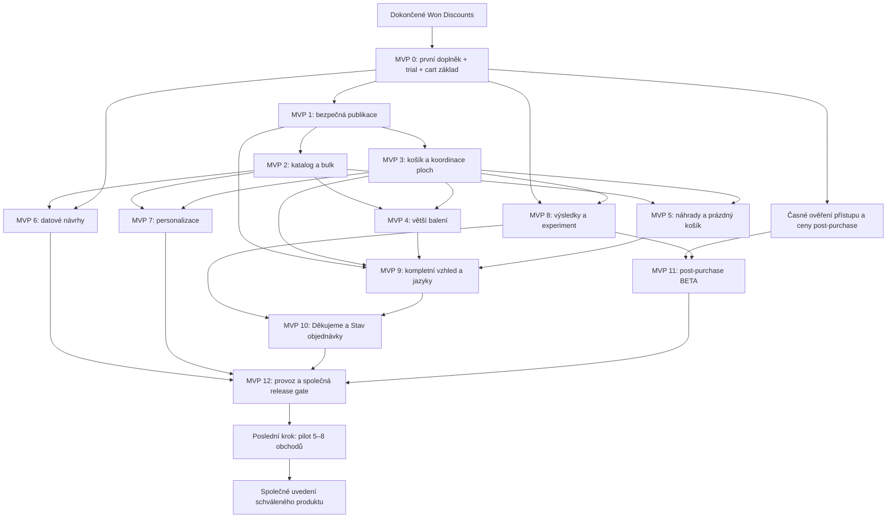

# Won Companion Product Blueprint v1

Produktový audit A–O · 2026-10-01 · uzavřený produktový rozsah a schválené defaulty; technické provedení a ověření před námi.

Vychází z [rozhodnutí](rozhodnuti.md), [roadmapy](../product-roadmap.html), [konkurenčního průzkumu](konkurence.md) a posledních upřesnění Ondřeje. Pasted prompt o CMS používáme jako auditní metodiku. Předmětem je Shopify aplikace pro doporučování produktů, doplňků a větších balení. Neproběhl code review ani hodnocení současné implementace.

**Jak číst status:** **Schváleno** znamená dosavadní rozhodnutí. **Doporučení** znamená nový produktový návrh tohoto auditu, včetně číselných výchozích hodnot. **Ověřit** znamená externí nebo empirickou nejistotu, kterou dokument sám nevyřeší. Neuvedené nové detaily jsou doporučení, nikoli zpětně připsaný souhlas. P0 = nezbytný základ; P1 = důležitá schopnost po prvním funkčním řezu; P2 = později. P1 neznamená automaticky odklad za společné uvedení.

**Následně schváleno 2026-10-01:** omezený editor, zjednodušení obchodních automatizací, odklad automatické trvanlivosti/váhové dopravy, nastavitelnost četnosti a A/B při downgrade. Schválené jsou také tarifní tabulka O.3 (Děkujeme/Stav objednávky výhradně Pro), explicitní Save/Publish, historie obnovy, pravidla znovunákupu, denní datové návrhy, experimentální defaulty, cíl čerstvosti 60 s a billing grace 24 h. Pilot patří až na úplný konec. Navržené provedení diagnostiky instalace H.6 není důkaz, že lze všechny stavy automaticky zjistit.

## A. Executive assessment

**Směr produktu je dobrý. Současný návrh ale zatím není dost přesný pro autonomní vývoj celé aplikace.** Dobře říká, co má Companion nabízet; méně přesně říká, jak merchant pozná, že nabídky skutečně běží správně, a co se stane při jejich změně, konfliktu nebo selhání.

Nejsilnější hodnotový příslib je: **„Nastav správné doplňky a větší balení pro svůj katalog, zkontroluj jejich chování a nabídni je v původním nákupním toku.“** Ruční merchandising je plnohodnotná hodnota. Datové návrhy mají postupně snižovat práci, ne omlouvat špatný první den bez dat.

Největší zbylé nebezpečí je kombinace širokého rozsahu a levného tarifu. Basic za $10 musí být užitečný sám o sobě, ale zároveň nesmí vyžadovat pravidelné ruční zásahy vývojáře do tématu. Vyšší cena Pro tento problém sama neřeší. Druhé riziko: menší obchod může potřebovat Basic a nemít dost dat pro hlavní argumenty Pro. To není důvod uměle ochudit Basic; je to hypotéza k ověření na skutečných klientech.

Zachovávám **14 dní Pro trial → Basic $10 nebo Pro $30**, všechny schválené plochy, merchantovu kontrolu vztahů a mapování balení, samostatnost vůči Discounts, BETA a vlastní ověřování Dawn/Horizon. Zachovávám také společné uvedení celého schváleného produktu. Níže uvedená MVP jsou **interní dokončené E2E etapy**, nikoli návrat k postupně prodávaným fragmentům.

Nejdůležitější přestavba roadmapy: billing, diagnostika, pravidla publikace a měřicí kontrakt musí vznikat s první funkční nabídkou. Pokročilé reporty přijdou později. Samostatný krok „foundation“ bez jediné skutečné nabídky by pouze odložil zjištění, zda celý tok funguje.

## B. Biggest product risks

| # | Priorita | Riziko a konkrétní selhání | Doporučená reakce |
|---|---|---|---|
| 1 | P0 | **Nejasný výsledek změny košíku.** Timeout po kliknutí neříká, zda byl produkt přidán. Opakování může zdvojit nákup; swap může nechat oba produkty nebo odstranit původní. | Výsledek potvrdit skutečným košíkem; definovat obnovu a uživatelský stav „Ověřujeme změnu“. Nejistý výsledek nikdy nevydávat za úspěch. |
| 2 | P0 | **Podpora témat sežere ekonomiku.** „BETA“ nesnižuje práci při každém rozbitém draweru. | Matice konkrétních verzí Dawn/Horizon, diagnostika připojení každé plochy, žádné tiché přepsání DOM libovolného tématu. |
| 3 | P0 | **Publikované neznamená účinné.** Merchant uloží pravidlo, ale embed je vypnutý nebo aktivní téma jiné. | Oddělit stav draftu, publikované konfigurace a skutečné dostupnosti plochy; zobrazit přímou cestu k nápravě. |
| 4 | P1 | **Zobrazení ceny se zbytečně rozšíří na řešení slev.** Nový blok musí správně převzít údaje, ale nemusí předpovídat slevu po budoucím přidání. | Zobrazit dostupnou cenu produktu/varianty v aktuálním kontextu; po změně košíku převzít výsledek Shopify. Neimplementovat pravidla cizích slevových aplikací; jejich nastavení a funkčnost řeší merchant. |
| 5 | P0 | **Ruční přiřazení působí jako garance kompatibility.** B může být doplněk k A, ale ne ke všem jeho variantám. | Produktový vztah i volitelné variantové omezení, konkrétní výběr varianty; import nepovýšit na ověřenou technickou kompatibilitu. |
| 6 | P0 | **Pravidla se přetlačují.** A i C doporučují B, jiná pravidla ho vylučují; větší balení mění stejný řádek jako jiná nabídka. | Jedna deterministická posloupnost vyhodnocení, společná deduplikace a diagnostika vítěze i vyřazených kandidátů. |
| 7 | P0 | **Downgrade, rollback nebo výpadek rozšíří publikum.** Zmizí Pro podmínka a nabídka se zobrazí všem. | Pozastavit celé závislé pravidlo. Obnovení staré verze musí znovu projít aktuálními oprávněními a validací. |
| 8 | P0 | **Měření slíbí přínos, který neprokazuje.** Objednávka po kliknutí není dodatečná objednávka. | Tři oddělené pohledy: společné nákupy, připsané interakce, experimentální odhad. Způsobilost měřit i v kontrolní skupině. |
| 9 | P0 | **Chybné vypnutí nebo nekonzistentní konfigurace na otevřené stránce.** Některé nabídky používají nová pravidla a jiné staré. | Verzovaný účinný celek, omezená platnost a potlačení nových nabídek po neúspěšném obnovení. |
| 10 | P1 | **Sto produktů znamená sto minut nastavování.** Jednoduchost jednotlivé karty zakryje únavnou katalogovou práci. | Hromadné návrhy, schválení, vyřazení, filtry a přehled pokrytí; měřit celý první setup. |
| 11 | P1 | **Nejasná hodnota Pro za trojnásobek Basic.** Malý obchod nemá dost objednávek pro datové návrhy ani experiment. | Pro prodává průběžnou úsporu práce a cílení; v trialu ukázat reálnou dostupnost dat. Neslibovat výsledek testu do 14 dní. |
| 12 | P1 | **Automatika se učí sama ze sebe.** Doporučené B zvýší počet A+B a následně dostane ještě vyšší skóre. | Odlišit známé ovlivněné interakce; neidentifikovatelné objednávky neoznačovat jako organické. Ukázat původ návrhu. |
| 13 | P1 | **Znovunákup odporuje vyloučení již koupeného.** Globální pravidlo zablokuje celý zamýšlený use case. | Znovunákup jako výslovná výjimka pouze pro tento typ pravidla; ostatní doporučení zůstávají potlačená. |
| 14 | P1 | **Post-purchase zablokuje společné uvedení.** Vývoj je hotový, ale platformní přístup či část plateb není dostupná. | Ověřit přístup a cenovou cestu hned na začátku; vývojově samostatná větev, samostatná capability gate. Omezení zveřejnit. |
| 15 | P1 | **Editor vzhledu se stane druhým produktem.** Čas spolkne vnořené DnD místo správných nabídek. | Kurátorované varianty karty a omezené řazení obsahu. Žádný strom sekcí a stránek. |
| 16 | P1 | **Neviditelná nabídka je nerozlišitelná od poruchy.** Merchant netuší, zda není kandidát, souhlas, tarif, dostupnost nebo připojení plochy. | „Proč se nabídka nezobrazuje?“ musí být součástí každého pravidla, nikoli log pouze pro vývojáře. |
| 17 | P1 | **Zachování konfigurace se změní v neomezené uchovávání dat.** Uninstall/reinstall obnoví nečekaně staré kampaně či osobní historii. | Oddělený lifecycle konfigurace, osobních dat a agregací; obnova vždy jako draft a nové ověření oprávnění. |
| 18 | P1 | **Všechny funkce opt-in vytvoří stěnu vypínačů.** Vzájemně neslučitelné kombinace budou na merchantovi. | Onboarding podle výsledku, vlastní přepínače v detailech, automatická validace závislostí. Safety invarianty nejsou vypínatelné funkce. |

Platformní podklad k riziku 1: Shopify rozlišuje řádky i podle vlastností a jejich klíč není neměnný; produktová identita proto nestačí k bezpečné výměně. [Cart API](https://shopify.dev/docs/api/ajax/reference/cart). K riziku 14: post-purchase zůstává beta, živý obchod potřebuje přístup a platforma omezuje dostupné nákupní scénáře. [Product offers](https://shopify.dev/docs/apps/build/checkout/product-offers).

## C. Missing features

„Chybí“ zde zahrnuje i věci zmíněné jednou větou, ale nedotažené do workflow.

| Funkce / workflow | Proč je potřeba | Priorita | Zařazení |
|---|---|---|---|
| Diagnostika pravidla pro konkrétní produkt/košík | Merchant potřebuje vidět vítěze, vyřazení a konkrétní opravu | P0 | MVP 0, rozšíření v každé etapě |
| Oddělené stavy draft / release / dostupná plocha | Uložení ani publikace nedokazují zobrazení | P0 | MVP 0–1 |
| Konflikt souběžných editací a obnova předchozí publikace | Chrání práci dvou zaměstnanců a bezpečný návrat | P0 | MVP 1 |
| Náhled s reálným katalogem a označenou simulací kontextu | Merchant nemá publikovat naslepo ani zaměnit demo za realitu | P0 | MVP 0, dále každá plocha |
| Výsledek mutace „ověřuji / potvrzeno / částečně / neznámé“ | Nestačí success toast či obecná chyba | P0 | MVP 0, swap v MVP 4 |
| Evidence oprávnění a jeho dočasné nejistoty | Trial/Basic/Pro nelze vyjádřit jedním booleanem | P0 | MVP 0 |
| Katalogový zdravotní stav vztahů | Smazaná varianta, změněné balení a jiné téma nesmějí zůstat skrytými závadami | P1 | MVP 2, 4, 12 |
| Hromadná správa a report částečných výsledků | Čas nastavení roste s katalogem, nikoli jen počtem funkcí | P1 | MVP 2 |
| Trvalé zamítnutí návrhu a historie původu vztahu | Bez toho appka opakovaně vytváří práci | P1 | MVP 2 a 6 |
| Coverage: kolik katalogu má použitelné vztahy | Umožní další smysluplný krok i bez objednávek | P1 | MVP 2 |
| Lidský důvod vypnutí a dopad downgrade před potvrzením | Merchant pozná, která pravidla zůstanou aktivní | P0 | MVP 0, postupné rozšíření |
| Lokalizované texty a dědičnost vzhledu | CS/SK/EN, RTL a mobil nejsou kosmetická oprava na konec | P0/P1 | Struktura MVP 0, úplné UX MVP 9 |
| Bezpečný import s náhledem a export vztahů | Převzetí dat nesmí přepisovat rozhodnutí merchanta | P1 | MVP 2; export MVP 12 |
| Dostupnost dat a čerstvost výpočtu | Nula objednávek, chybějící přístup a rozbitý job jsou tři různé stavy | P1 | MVP 6–8 |
| Diagnostický balíček pro podporu | Podpora potřebuje verzi, pravidlo, kontext a důvod bez zákaznických údajů | P1 | Základ MVP 0, provozní UI MVP 12 |
| Návrat po trialu, downgrade a reinstalaci | Zachovaná konfigurace nesmí znamenat automatickou reaktivaci | P1 | MVP 0 a 12 |

## D. Features that should be postponed

Zjednodušení obchodních automatizací, odklad trvanlivosti/váhové dopravy a omezený editor jsou **schválené 2026-10-01**. Ostatní redukce níže zůstávají doporučení ke změně rozsahu.

| Co odložit | Co ponechat v první verzi | Kdy složitost vrátit |
|---|---|---|
| Automatické řízení trvanlivosti | Ruční priorita relevantních produktů | Existuje spolehlivý zdroj šarží a ověřená poptávka |
| Automatický příslib stejného dopravného podle váhy | Běžné relevantní doplňky bez slibu dopravy | Prototyp ověří konkrétní dopravní konfigurace včetně rozdělených zásilek |
| Automatická optimalizace „zisku“ | Volitelná nákupní cena/hrubá marže jako informativní signál s pokrytím dat | Merchant rozumí výpočtu, úplnosti vstupů a vlivu na relevanci |
| Univerzální DnD editor | Pro: omezené řazení podporovaného obsahu, varianty layoutu, vlastní CSS | Testy s klienty odhalí opakovanou potřebu, kterou presety neřeší |
| Import každého konkurenta jedním klikem | S&D + zveřejněný formát importu a report | Pro konkrétního konkurenta existuje ověřený export a mapování |
| Plánované publikování a více paralelních kampaní s kalendářem | Jeden pracovní draft a explicitní publikování | Piloty opakovaně potřebují plánovat kampaně |
| Vlastní organizace, projekty, pozvánky a custom roles | Jeden obchod jako tenant a uživatelé přicházející přes Shopify | Skutečný požadavek více obchodů se společným řízením |
| Generativní AI a autonomní publikování doporučení | Návrhy podle katalogu a pozorovaných nákupů, potvrzení merchantem | Měřitelná úspora práce oproti jednoduchému návrhu; žádný návrat k zamítnuté auto-optimalizaci |

Post-purchase, znovunákup, vyprodané náhrady ani prázdný košík tímto bez souhlasu nevyřazuji. Jsou v interních etapách níže. Přístup na platformě je gate, nikoli funkce, kterou lze obejít označením BETA.

## E. Where we are overengineering

1. **Obecný builder.** Companion potřebuje správně ukázat produkt, cenu a akci. Strom sekcí, přesuny mezi stránkami a vnořené layouty by přinesly dlouhodobý závazek nesouvisející s hlavní hodnotou. Nahraďme je třemi variantami karty a omezenými presety. Rozšíření až po opakovaně doložené potřebě.
2. **Mnoho podobných pojmů.** „Bundle“, „FBT“, „ruční doporučení“ a „cross-sell“ mohou všechna skončit stejným A → B. Použijme jeden vztah s původem a schválením. Samostatným typem je až jiná akce, například výměna řádku.
3. **Enterprise publikování.** Více prostředí, větve, schvalovací komise a release train nejsou potřeba. Jeden draft, neměnný publikovaný celek a obnova s kontrolou stačí. Více draftů až při skutečně paralelních kampaních.
4. **Chytrá matematika nad slabými daty.** Skóre zisku, expirace a dopravy budí dojem přesnosti bez potřebných vstupů. První hodnotu poskytne vysvětlený návrh a merchantovo rozhodnutí. Automatiku vrátit pouze s odpovídajícími daty a ověřením.
5. **Platform admin jako druhá SaaS aplikace.** V první verzi potřebujeme bezpečné hledání instalace, poslední chybu, retry, historii a vypnutí plochy. Nepotřebujeme CRM, fakturační systém ani automatické úpravy cizího obchodu.
6. **Univerzální abstrakce témat před dvěma funkčními integracemi.** Nejprve doložit Dawn/Horizon. Sdílet skutečně společné chování; další adapter přidat podle konkrétní poptávky.

## F. Where we are underengineering

1. **Život vztahu po jeho založení.** Katalog se mění. Vztah potřebuje identitu, původ, validitu a možnost opravy; nestačí seznam ID produktů.
2. **Provozní viditelnost.** „Aktivní“ je příliš neurčité. Je třeba rozlišit zapnuté pravidlo, publikovanou verzi, dostupnou plochu a skutečně způsobilý nákupní kontext.
3. **Konzistence publikace.** Více zápisů do veřejných dat nesmí zákazníkovi namíchat dvě verze. Přepnutí na novou konfiguraci musí nastat až po připravení jejích závislostí; poslední funkční konfigurace zůstane dostupná při selhání.
4. **Přechody tarifu.** Nejde pouze o skrytí přepínače. Potřebujeme seznam dopadů, zachování nastavení a zákaz rozšíření cílení. Stejná pravidla musí platit i při restore.
5. **Undo versus náprava nákupu.** Vrátit text v editoru lze lokálně. Vrátit výměnu v košíku je nová skutečná operace s novými cenami a dostupností. Tlačítko „Zpět“ nesmí slibovat historický stav bez nového ověření.
6. **Výběr variant.** Karta produktu s povinnými možnostmi potřebuje rozumný tok výběru. Nikdy nepřidávat první variantu jen proto, aby fungovalo jedno kliknutí.
7. **Rozsah experimentu.** Návštěvník, prohlížeč, zákazník a objednávka nejsou zaměnitelné jednotky. Bez návaznosti na pozdější plochy nelze report nazvat přínosem celé aplikace.
8. **Bezpečné změny obsahu.** Smazání presetu, reset stylů, hromadný import a změna mapování jsou změny závislostí. UI musí předem ukázat dopad a návratovou cestu.
9. **Support diagnostika bez osobních dat.** „Pošli screenshot“ nesmí být jediná cesta. Merchant má umět sdílet redigovaný stav; zásah podpory musí být dohledatelný.

## G. Missing product primitives

Jde o produktové pojmy a smluvené chování, nikoli návrh databázových tabulek.

| Primitive | Minimální význam | Vznik | Co by bylo drahé předělávat |
|---|---|---|---|
| Obchod / instalace | Stabilní identita obchodu, lifecycle instalace, ověřený aktér | MVP 0 | Míchání tenantů, historie po reinstalaci |
| Vztah | Zdroj → cílový produkt/varianta; typ doplněk/náhrada; původ a stav schválení | MVP 0 | Oddělené duplicitní modely pro ruční a datové vztahy |
| Pravidlo | Cíl, spouštěč, publikum, vztahy, priorita, plochy a přepínač | MVP 0 | Různá precedence na každé ploše |
| Mapování balení | Konkrétní zdroj/cíl, atributy, zdrojový počet, cílový počet, potvrzení | Návrh MVP 0, tok MVP 4 | Univerzální převody odvozené z názvu či ceny |
| Kontext nabídky | Košík/PDP/objednávka, vybrané varianty, market, měna, locale, schopnosti plochy | MVP 0 | Cenové chyby a nevhodné varianty |
| Výsledek způsobilosti | Ano/ne + stabilní důvod + odkaz na opravu v adminu | MVP 0 | Zpětné domýšlení „proč nic nevidím“ z logů |
| Záměr akce | Přidat / nahradit / přejít na nový nákup; jednoznačný pokus a ověřený výsledek | MVP 0 | Duplicity a nejasné měření úspěchu |
| Draft / revize / release | Rozpracovaný celek; číslo změny; publikovaný neměnný snapshot | MVP 0–1 | Nevratné publikace a smíchané verze |
| Stav oprávnění | Trial/Basic/Pro/neaktivní; poslední ověření, jistá expirace, nejistota | MVP 0 | Free fallback a nechtěné Pro funkce |
| Původ a zamítnutí | Ruční/import/datový návrh, zdrojová verze, vědomé odmítnutí | MVP 2 | Přepočet přepisující lidské rozhodnutí |
| Design preset | Sdílený vzhled konkrétní plochy, locale textů a řízené mobilní overrides | Základ MVP 0, MVP 9 | Nekontrolované kopie a dědičnost |
| Událost / experiment | Způsobilost, přiřazení, zobrazení, akce, potvrzená změna, nákup; oddělené identity | Kontrakt MVP 0, tok MVP 8 | Neobnovitelné chybějící denominátory |
| Capability | Ověřená schopnost instalace/plochy, nikoli jen tarif | MVP 0 | Falešné „zapnuto“ při chybějící platformní podpoře |
| Dlouhá úloha | Průběh, poslední úspěch, retry a výsledek jednotlivých položek | MVP 2 | Ztráta změn při zavření adminu |
| Auditní událost | Kdo, co, kdy, obchod, revize, výsledek, trace; bez zbytečných osobních dat | MVP 0 | Nemožnost vysvětlit změnu zákazníkovi |

## H. Recommended information architecture

### H.1 Merchant admin

Pět hlavních míst stačí:

1. **Přehled:** běží / potřebuje zásah, aktivní plochy, pokrytí katalogu, poslední publikace, stav dat a jedna nejdůležitější další akce. Žádná vymyšlená tržba v prázdném dashboardu.
2. **Doporučení:** seznam s filtry; založit „Doplněk“, „Větší balení“, „Náhradu vyprodaného“ nebo „Znovunákup“. Datové návrhy jsou druhá záložka stejného místa. Import a hromadné akce jsou zde.
3. **Zobrazení:** plochy a jejich připojení; u vybrané plochy obsah/vzhled a náhled. Vypínač, který ovládá konkrétní chování, zůstává u něj, nikoli v druhém nesouvisejícím seznamu.
4. **Výsledky:** „Společné nákupy“, „Interakce a připsané nákupy“, „Experimenty“. Vždy období, rozsah, čerstvost a dostupnost dat. Pro pohledy na Basic vysvětlit a umožnit označený admin preview, ne živý sběr bez oprávnění.
5. **Nastavení:** tarif, jazyk, data, oprávnění, import/export historie, diagnostika a podpora. Publikační historie je dostupná také přímo z horního stavového panelu.

Editor pravidla: **Co nabídnout → Kdy a komu → Kde → Náhled a kontrola.** Jde o sekce jednoho pracovního místa; každá změna relevantní pro zákazníka se projeví v náhledu. Diagnostika konkrétního košíku je samostatná akce, nikoli rozrůstající se scénářový přepínač vzhledového studia. Náhled s fiktivní identitou zákazníka či demonstračními daty je zřetelně simulovaný a nevytváří reálný nákup ani analytické výsledky.

### H.2 Builder převedený na relevantní editor

**Struktura:** plocha → seznam nabídek → karta nabídky. Žádné stránky, sekce ve stránkách, libovolné vnořování ani přesouvání mezi stránkami.

**Varianty karty:** kompaktní řádek, vertikální karta a zvýrazněná jedna nabídka. Jejich dostupnost závisí na ploše; drawer nemusí podporovat mřížku. Přepnutí varianty zachová produkt, text, akci a podporované hodnoty. Nepoužité nastavení zůstává v draftu se zřetelným označením; publikace nese jen účinné hodnoty. Odstraněná varianta se nesmí potichu změnit v jinou aktivní nabídku: nabídnout migraci a náhled, do vyřešení nepublikovat.

| Řídí systém | Merchant může nastavit | Nepovolit |
|---|---|---|
| Semantiku, pořadí klávesnice, minimum ovládacích ploch, povinnou cenu a CTA | Podporovanou variantu, zarovnání textu, poměr obrázku, hustotu ze 3 voleb | Absolutní pozice, libovolné JS/HTML, překrytí checkoutu |
| Mobilní bezpečné minimum, focus, reduced motion, chování dialogu | Barvy/tokeny v mezích validace, radius, podporované šířky a mezery | Skrytí ceny, varianty nebo potřebného ovládání před potvrzením |
| Cenový formát a měnu z kontextu | Nadpis, důvod doporučení, srozumitelný CTA text v dané akci | Statickou ručně napsanou částku vydávanou za aktuální cenu |
| Povinnou hierarchii produkt → varianta/cena → akce | Pro: řazení volitelných částí obsahu, vlastní CSS v podporovaném rozsahu | Vnořené containery a CSS zasahující do zbytku tématu |

**Schválená hranice editoru:** běžné pořadí doporučených produktů zůstává Basic, i pokud se ovládá přetažením. Pro přidává pokročilejší kompozici podporovaných částí karty a vlastní CSS. Šipky „nahoru/dolů“ musí nabídnout odpovídající řazení klávesnicí i na dotyku. Viditelný insertion indicator, neplatná drop zóna s vysvětlením, přesun jako jeden undo krok. Žádné nested drop zones, přesouvání mezi plochami či potřebný DnD na mobilu. Konkrétní varianty a ovládací detaily v H.2–H.3 zůstávají návrhem provedení schválené hranice.

### H.3 Responsive a sdílený vzhled

Náhled desktop 1280 a mobile 390; šířka 768 je testovací mezistav, ne třetí sada nastavení. Doporučená hranice mobilního režimu 768 CSS px; konkrétní adapter smí být přísnější podle šířky hostitelského kontejneru. Karta v úzkém desktop draweru proto stále použije úzký layout.

Mobil dědí základ. Vlastní hodnoty pouze pro hustotu, poměr obrázku a podporovaný způsob skládání. UI ukáže „Zděděno“ nebo „Vlastní pro mobil“ a reset jedné hodnoty. Mobilní změna nesmí změnit desktop. Bez vlastních breakpointů, font size pro každý viewport, odlišného skrytí pravidla nebo důležitých ovládacích prvků. Post-add modal se na mobilu převádí na bottom sheet systémově.

**Reusable model:** jeden sdílený preset vzhledu pro plochu; změna ukáže seznam ovlivněných ploch a publikuje se vědomě. Lokální override je omezený a má reset. „Duplikovat pravidlo“ vytváří nezávislou kopii v draftu. Starter template vytvoří počáteční konfiguraci a není živě synchronizovaný. Další pojmy jako synced section, global block a page template nepotřebujeme. Smazání používaného presetu vyžaduje náhradu nebo převedení na lokální kopii s náhledem dopadu.

### H.4 Život konfigurace

**Schválený základ:** editace → „Neuloženo“ → explicitní „Uložit návrh“ → „Uloženo, nepublikováno“ → kontrola rozdílů → „Publikovat“ → stav publikace a připojení ploch. Drží se contextual save-bar z Won doctrine. Každý stav má trvale viditelný text, odpovídající hlavní akci a odlišitelný vzhled i bez spoléhání pouze na barvu. Náhled je zřetelně označen „Návrh“, živá verze má datum/čas publikace a stav ploch. Autosave není podmínkou v1; při odchodu varovat před ztrátou neuložené práce.

- **Undo/redo:** lokální editace jednoho pravidla nebo vzhledu, včetně přesunu/smazání/změny varianty; jeden významový úkon = jeden krok. Nepřežívá reload; UI to neslibuje. Uložení nepublikuje. Publikování historii lokálních operací uzavře.
- **Draft revize:** poslední uložený pracovní stav a kontrola, že jiný editor mezitím neuložil novější. V1 nebuduje nekonečnou historii každého úhozu.
- **Publikační historie:** neměnné účinné konfigurace. Schváleno uchovat posledních 20 publikací nejvýše 90 dní, aktuální vždy; bez osobních dat.
- **Restore:** starou publikaci otevře jako nový draft; ukáže diff a aktuální problémy. Teprve nová validovaná publikace je rollback. Nemění ceny v Shopify a nevrací skutečné košíky.
- **Souběh:** druhý editor nesmí přepsat cizí změnu. Dostane porovnání změněných oblastí a možnost zachovat vlastní text při načtení novější verze; žádné automatické slučování rozporuplných pravidel.
- **Build Mode:** pouze nepublikovaný draft a oddělený náhled. Nepřidávat další režim, který mění význam tlačítek.

Preflight rozlišuje **blokující chybu** (chybějící povinná varianta, neplatné mapování, cyklus swapů, neoprávněná funkce, konflikt revize), **varování** (plocha není připojená, nyní nedostupný produkt, chybějící obrázek/překlad) a **doporučení** (slabé pokrytí katalogu). Dočasně vyprodaný cíl blokuje konkrétní nabídku za běhu; nesmí zabránit publikaci opravy jiného pravidla. Neoprávněné či rozbité pravidlo lze publikovat jen explicitně pozastavené. Selhání publikace zachová předchozí release a draft; retry nesmí založit dvojí release.

### H.5 Oprávnění, média a provoz

Jeden Shopify obchod = jeden tenant. Žádná vlastní organizace, projekt ani pozvánka navíc. Přístup a obchod ověřovat pro každý účinek, včetně exportu, jobu a obnovy. Doporučený v1 model: uživatel s oprávněným přístupem do aplikace může spravovat pravidla; nákup tarifu řídí Shopify autorizační tok. Vlastní editor/publisher/viewer role nepřidávat bez potřeby. Dostupnost detailnějších Shopify oprávnění je implementační ověření; nelze ji nahradit klientským přepínačem role.

Média se přebírají z produktového katalogu Shopify: správný variantový obrázek, případně produktový fallback, jinak kultivovaný stav bez obrázku. Zachovat dostupný alt, nevyrábět marketingové tvrzení. Merchant upravuje zdroj v Shopify přes odkaz. V1 nemá vlastní upload, knihovnu souborů, duplicity médií ani crop editor. URL produktů řešit jako reference podle aktuálního jazyka, nikoli uložené kopie handle. Companion neřídí SEO stránek, canonical, sitemap, menus, header/footer ani formulářové submissions.

Platformní administrace Won je oddělená: stav instalace, vydaná verze, capability, chyby úloh, čas posledního úspěchu, bezpečný retry a nouzové vypnutí. Přístup podpory auditovat; běžný pohled bez PII. Žádné automatické impersonation, ruční přidávání produktů zákazníkům či publikace za merchanta.

### H.6 Ověření po instalaci a při prvním otevření nastavení

Navržené provedení požadavku na rychlý test klientova obchodu: jeden průvodce se samostatným výsledkem pro PDP, cart/drawer, post-add, Děkujeme, Stav objednávky a one-click post-purchase. Poslední tři plochy jsou Pro/trial Pro. Kontrola nesmí měnit tarif ani sama zapínat nabídky.

1. **Automatická kontrola bez nákupu:** po instalaci a prvním otevření nastavení ověřit dostupné údaje o oprávnění, konfiguraci, katalogu a připojení podporovaných ploch. Kontrola běží na pozadí, nespouští se duplicitně při každém otevření. U údajů, které Shopify nebo téma neposkytne spolehlivě, zobrazit „Nelze automaticky zjistit“ s konkrétním dalším krokem. Výběr post-purchase aplikace nebo aktivaci bloku nepředstírat jako programově ověřenou bez doloženého mechanismu.
2. **Náhled a kontrola zapojení:** otevřít odpovídající nastavení/náhled, nechat merchanta dokončit připojení; skutečné načtení plochy lze doložit hlášením extension, kde je technicky dostupné. Náhled neověřuje nákup a samotné zobrazení karty neověřuje její akci.
3. **Řízený objednávkový test:** merchant vědomě spustí průvodce. Vývojové E2E běží na kanonickém dev storu; na klientově obchodě se volí podporovaný a merchantem odsouhlasený postup. Nikdy automaticky nepřepínat platební bránu do testovacího režimu, nevytvářet placené objednávky, neprovádět refund/storno ani neodesílat zákaznické zprávy jen kvůli instalaci či otevření nastavení. Je-li k reálnému testu nutná objednávka, průvodce předem vysvětlí dopad a nechá její provedení výslovně potvrdit. Vývojový test nesmí vyžadovat zásah do plateb živého obchodu.
4. **Důkaz výsledku:** post-purchase ověřit odděleně pro zobrazení, odmítnutí a přijetí s potvrzenou změnou konkrétní objednávky. Děkujeme/Stav objednávky ověřit zvlášť včetně odpovídajícího nového nákupního toku; jejich úspěch nedokládá post-purchase. Jediný úspěšný průchod neprokazuje všechny platební metody, měny nebo doručení.

Merchant vidí konkrétní stavy: „Nastavení zkontrolováno“, „Čeká na připojení“, „Čeká na test objednávkou“, „Ověřeno pro tento průchod“, „Neověřeno“ nebo „Nepodporováno v tomto kontextu“. Každý výsledek má čas, plochu, relevantní konfiguraci/verzi a rozsah důkazu. Výpadek či nedostupný údaj není automaticky důkaz nepodpory. Nedostupnou příčinu nezobrazení Shopify nelze domýšlet.

Změna relevantní konfigurace zneplatní odpovídající důkaz a nabídne nový test. Simulované/testovací události oddělit od skutečných výsledků doporučování; běžný provoz neposílat do testovacího režimu. Ověření instalace je produktová diagnostika, závěrečný pilot s klienty je samostatná poslední etapa.

Shopify dokumentuje vývojové ověření post-purchase přes testovací objednávku na dev storu; živá dostupnost vyžaduje přístup a má vlastní omezení. Tyto podklady nedokládají existenci univerzálního bezplatného samočinného testu na každém živém obchodě. [Post-purchase test](https://shopify.dev/docs/apps/build/checkout/product-offers/build-a-post-purchase-offer), [živá dostupnost](https://shopify.dev/docs/apps/build/checkout/product-offers).

## I. Recommended final roadmap

### Společná definice dokončení každé etapy

Každé MVP níže je vertikální cesta od nastavení přes uložená data a pravidla po skutečný výsledek. Žádná etapa nekončí pouhým modelem, API nebo obrazovkou. Funkce budoucích etap se v ní nevydávají za hotové. Před veřejným společným uvedením musí projít všechny schválené schopnosti; žádné automatické vyškrtnutí blokované části.

Každá etapa zahrnuje autorizaci obchodu a tarifu; persistence po reloadu; empty/loading/error stav; neuloženou změnu; validaci; katalogovou změnu; souběh; diagnostický důvod; audit změn; klávesnici, touch, dlouhé texty a chybějící obrázek. Akceptace znamená skutečný výsledek, nikoli jen viditelný toast. U osobních dat se testuje i jiná identita a ztráta oprávnění.

**Navržené testovací a výkonové cíle, zatím nezměřené:** fixture 1 000 produktů, 5 000 variant, 1 000 vztahů; katalogové hledání a filtrování p95 do 1 s po přijetí požadavku; odezva lokálního náhledu do 100 ms; uložený draft p95 do 2 s bez uměle vloženého výpadku. Ve storefrontu žádné čekání nativního add-to-cart/checkoutu na doporučovací službu; při nedostupném výsledku do 1 s nabídku vynechat. Porovnat 20 párových běhů stejné produktové stránky s/bez appky, stejný cache/network/device profil: medián zhoršení LCP nejvýše 100 ms a žádný nový posun layoutu z načtení doporučení nad 0,02 CLS. Výsledky uvést s rozptylem; nejde o univerzální garanci rychlosti každého obchodu.

Storefront E2E běží na `b2b-b2c-store-development.myshopify.com`, Dawn i Horizon, zaznamenané verze témat. Viewporty 390/768/1280, `assertResponsiveSane` na mobilu a `assertCarousel` u carouselu. Vedle Playwright je nutný test čisté rozhodovací logiky, řízené výpadky, kontrakty extension a ruční klávesnice/screen reader. Screenshot sám neověří košík, přístupnost ani účtování.

### MVP 0 — První skutečný doplněk od instalace po košík

**Goal:** ověřit hlavní hodnotu na nejmenší úplné cestě. **User outcome:** merchant nastaví A → B a zákazník z PDP A bezpečně přidá zvolenou variantu B do skutečného košíku.

**Scope:** instalace a tenant; skutečný trial/Basic/Pro/neaktivní stav v testovacím billing toku; onboarding „Nabídnout doplněk“; výběr A/B, případně variantové omezení, text důvodu; jeden systémový vzhled; desktop/mobile preview; uložený draft a první explicitní publikace; připojení PDP a první instalační diagnostika dle H.6; vyloučení nedostupného a již přítomného produktu; variant picker; potvrzené přidání; vypnutí; stručná diagnostika. V této cestě vzniká první funkční část plánovaného cart-core. Definovat identitu událostí a verzi konfigurace; kompletní analytické UI se zatím nestaví.

**Out of scope:** drawer, modal, swap, import, datové návrhy, personalizace a experimentální report. **Dependencies:** dokončení Won Discounts před prací ve sdíleném jádru; dev store a ověření zvolené cenové cesty. Současně zahájit ověření platformního přístupu pro budoucí post-purchase, aby překvapení nepřišlo v MVP 11.

**Foundation created for later:** obchod, vztah, pravidlo, capability, draft/release ID, kontext ceny, důvod způsobilosti, záměr akce a test skutečného košíku.

**Acceptance criteria:** A/B nastavení přežije reload; nepublikovaný B se nikomu nezobrazí; po publikaci zákazník vloží přesně vybranou variantu v počtu 1; dvojklik nevytvoří dvě změny; známá expirace zastaví nové nabídky a zachová košík; druhý obchod nedokáže pravidlo číst ani změnit. Zamítnutí billing potvrzení nevytvoří placený přístup.

**UX edge cases:** prázdný katalog nabídne otevření Shopify produktů; jedna/mnoho variant; B odstraněno před nákupem; připojený blok bez publikovaného pravidla; síťový timeout; odebraná oprávnění.

**Product risks:** technicky zelená karta, která se kupujícímu nezobrazí; nemožnost zjistit cenu pro cílový kontext; přidání jiné varianty.

**Testing scenarios:** Playwright nastaví a publikuje A → B, načte PDP, zvolí variantu a ověří skutečný cart. Dále Basic/Pro/trial/neaktivní; dvě instalace; dvojklik; response timeout po úspěšném serverovém add; odpojená app plocha. Protimeoutový test ověří reconciliaci, nikoli slepé retry.

### MVP 1 — Bezpečná změna a obnovení živé konfigurace

**Goal:** změnit fungující nabídku bez překvapení v obchodě. **User outcome:** merchant upraví B na C, zkontroluje dopad, publikuje a podle potřeby obnoví B.

**Scope:** publikační historie; diff relevantních změn; preflight; lokální undo/redo; konflikt dvou editorů; restore jako nový draft; publikace kompletní připravené konfigurace; průběh/neúspěch/retry; omezená platnost otevřeného storefrontu; přehled účinné verze. Nouzové vypnutí je oddělené od rozpracovaného draftu a auditované.

**Out of scope:** kalendář, více pracovních větví, automatické slučování, historie každého stisku klávesy. **Dependencies:** MVP 0. **Foundation created for later:** všechny další funkce používají stejnou publikaci a obnovu, nevytvářejí vlastní Save/Publish význam.

**Acceptance criteria:** editace nezmění živý B; selhání přípravy C ponechá poslední platnou publikaci; souběžné uložení nevymaže první změnu; restore nabídne aktuální validaci; stará Pro konfigurace na Basic neobnoví Pro běh. Schválený cíl platnosti konfigurace 60 s: po této lhůtě a neúspěšném ověření se nespustí další nabídka ani její nová akce; původní košík pokračuje. Jde o schválený požadavek, nikoli současnou ověřenou vlastnost.

**UX edge cases:** uživatel zavře admin během publikace; síť vypadne po odeslání; smazaná reference ve staré verzi; poslední release mimo historii; neuložená editace při restore.

**Product risks:** falešná atomicita při zápisu do více míst; publikace jedním uživatelem omylem zahrne cizí draft. Diff musí ukázat celý publikovaný celek a autory dotčených změn.

**Testing scenarios:** dva browser contexts editují stejnou revizi; přerušení publikace v každém kroku; znovuotevření adminu ukáže skutečný stav; otevřená PDP překročí TTL; rollback přes downgrade; undo smazání a přepnutí vzhledové varianty.

### MVP 2 — Správa katalogu bez nastavování produktu po produktu

**Goal:** dostat správné vztahy na větší část katalogu. **User outcome:** merchant vyhledá skupinu produktů, převezme nebo vytvoří vztahy, opraví výjimky a publikuje vybranou sadu.

**Scope:** hledání podle názvu/SKU/ID; filtry typ/stav/původ/bez vztahu; multiselect; hromadné nastavení doplňků a vyloučení; duplicita pravidla jako vypnutý draft; import S&D se zdrojem a dry-run; kontrola konfliktů; výsledek po položkách; uložené zamítnutí; katalogové problémy; počet pokrytých a nepokrytých produktů. Vztahy jsou směrované, A → B nevytváří B → A automaticky.

**Out of scope:** neověřené exporty konkurentů, cross-store synchronizace, datové doporučování nových vztahů. **Dependencies:** MVP 1. **Foundation created for later:** provenance, tombstone zamítnutí, stabilní vztahy a opakovatelné dlouhé úlohy.

**Acceptance criteria:** z testovacích 100 vybraných produktů se aplikuje přesně potvrzená sada; nevalidní záznamy mají jednotlivé důvody; opakování stejného importu nevytvoří duplicity a nepřepíše ruční opravu; zavření adminu neztratí dokončený výsledek. Hromadná akce nejprve ukáže skutečný počet dotčených položek, včetně volby „všechny výsledky“ versus „tato stránka“.

**UX edge cases:** chybějící SKU, stejné SKU, smazané produkty, změna katalogu během jobu, nulový import, desetitisícové výsledky, vrácení hromadné operace při novějších ručních změnách.

**Product risks:** nesprávná kompatibilita hromadně; současný import působí jako živá synchronizace. Import preview výslovně říká, že další správu převezme Companion.

**Testing scenarios:** S&D import → ruční oprava → reimport; odmítnutý pár po přepočtu; chyba 3 ze 100 záznamů; výběr napříč stránkami; zrušení úlohy zastaví dosud neprovedenou práci, dokončené změny neoznačí za automaticky vrácené. Bulk undo navrhne reverzní diff a chrání mezitím upravené vztahy.

### MVP 3 — Doporučení napříč košíkem bez soupeřících oken

**Goal:** nabídnout doplněk ve správnou chvíli a zachovat nákupní tok tématu. **User outcome:** merchant použije stejná pravidla na PDP, po přidání a v původním košíku/draweru.

**Scope:** cart page, nativní drawer, post-add dialog a mobilní bottom sheet; koordinátor automatického otevření; výběr z celého košíku; explicitní priorita pravidel; deduplikace; odmítnutí napříč plochami; frequency cap; burst add; potlačení zacyklení po přidání doporučeného B. Připojení každé plochy má vlastní stav a vlastní náhled.

**Out of scope:** vlastní drawer, libovolná témata, swap. **Dependencies:** MVP 1; katalogová správa MVP 2 je doporučená, nikoli nutná pro algoritmus. **Foundation created for later:** jednotné vyhodnocení kontextu a koordinace ploch, které využije swap i personalizace.

**Acceptance criteria:** jedna akce otevře nejvýš jednu Companion plochu automaticky; stejný B ze dvou pravidel se nabídne jednou; B v košíku se nenabídne znovu; Companionem přidané B neotevře další automatický dialog. Odmítnutí se neuvolní změnou pravidla nebo přechodem PDP → cart během nastavené doby potlačení. Merchantova změna četnosti přežije uložení/publikaci a projeví se v dalším způsobilém průchodu; default není pevný limit. Přesná politika je v O.

**UX edge cases:** jiná app otevírá svůj modal; rychlé přidání A+C; drawer překreslí DOM; přechod mezi taby; zákazník zavře dialog během načítání; custom theme bez ověřeného adapteru.

**Product risks:** Companion nemůže garantovat kontrolu libovolné cizí appky. U známé kolize zvolí neautomatickou plochu nebo nabídku potlačí; nepřebírá checkout či tlačítka tématu.

**Testing scenarios:** Dawn/Horizon po re-renderu draweru; souběh Won Toasts a Discounts; default a merchantem změněná četnost/počet karet/interval; respektování odmítnutí a ochrany proti řetězení při obou nastaveních; opakovaný click/burst; dvě karty prohlížeče; fokus do/z dialogu, Escape a reduced motion; nepodporovaná plocha ukáže merchantovi konkrétní omezení, ne falešný zelený stav.

### MVP 4 — Větší balení s potvrzeným mapováním a obnovou po chybě

**Goal:** nabídnout konkrétní výměnu místo univerzálního přepočtu balení. **User outcome:** merchant jednotlivě i hromadně potvrdí mapování; zákazník ví, co zmizí a co přibude, vidí převzatou cenu cílové varianty. Výslednou cenu košíku včetně případných slev určí Shopify po změně; Companion nepředpovídá slevová pravidla.

**Scope:** zdrojová a cílová varianta, atributy, zdrojový/cílový počet; návrhy ze známých velikostí; bulk potvrzení s výjimkami; preview výsledku; zachování nezaměňovaných řádků; ochrana special properties, subscription/gift/bundle řádků; detekce cyklů; ověření skutečného výsledku a obnova. Změněný obchodní atribut mapování vyžaduje opětovnou kontrolu; běžná změna ceny aktualizuje nabídku a nevyžaduje nové merchantovo schválení vztahu.

**Out of scope:** rozebírání bundle produktů, automatické jednotkové převody bez potvrzení, cenová/maržová/dopravní garance. **Dependencies:** MVP 2–3. **Foundation created for later:** bezpečná sémantika výměny a auditovaný výsledek složené akce.

**Acceptance criteria:** mapování „2× malé → 1× velké“ se nabídne jen v definovaném množství a atributovém kontextu; jiná příchuť se nevybere automaticky; B již v košíku nevede k nejasnému sloučení bez náhledu. Při každém vloženém selhání nesmí nezamýšleně zmizet původní řádek. Nejasný/částečný výsledek se skutečně zobrazí, native cart zůstane použitelný a nový swap se do vyřešení nenabízí.

**UX edge cases:** původní řádek změněn z jiného tabu; cílový produkt vyprodán po náhledu; cena se změnila; velikost není číslo; složená sada atributů; nedělitelný počet; zákazník chce výměnu vrátit.

**Product risks:** Shopify košík nelze produktovým textem prohlásit za transakci. Pokud bezpečný rollback určitého řádku nelze doložit, tento případ se označí jako nepodporovaný a nabídka se potlačí.

**Testing scenarios:** chyba před prvním zápisem, po přidání cíle, při odebrání zdroje a při návratu; timeout po skutečném úspěchu; dvě karty; jiné properties stejné varianty; změna množství; každý test ověří skutečné řádky/počty, ne jen UI.

### MVP 5 — Smysluplná nabídka při vyprodání a prázdném košíku

**Goal:** zachovat relevanci i bez běžného zdrojového košíku. **User outcome:** merchant schválí náhrady vyprodaného a určí, co se smí zobrazit v prázdném košíku.

**Scope:** náhrada jako odlišný typ vztahu s důvodem, katalogový návrh k potvrzení, kontrola kompatibilních atributů; prázdný košík s volitelnými bestsellery a nedávno prohlíženými; jasné pořadí těchto zdrojů; prázdný výsledek nic nezobrazuje. Oba toky používají běžné přidání, ne skrytou výměnu.

**Out of scope:** tvrzení technické kompatibility odvozené jen z kolekce, sledování zákazníka napříč obchody, náhrada již koupeného produktu. **Dependencies:** MVP 2–3. **Foundation created for later:** společné zacházení s chybějícím triggerem a kontextovým typem pravidla.

**Acceptance criteria:** náhrada se nabídne jen pro skutečně nedostupný zdroj podle konfigurace; po obnovení dostupnosti se daný trigger neuplatní; bestseller bez podkladů nevytvoří falešné pořadí; recent views respektují dostupné oprávnění ke sledování a bez něj se nepředstírají. V prázdném košíku nemá plocha prázdný nadpis ani mrtvé CTA.

**UX edge cases:** zdroj má jen jednu vyprodanou variantu; všechny náhrady vyprodány; žádná historie; ztráta souhlasu; původně prázdný košík se mezitím naplní.

**Product risks:** záměna alternativy a doplňku; popularita vytlačí relevance. Typ vztahu proto zůstává viditelný i v bulk náhledu.

**Testing scenarios:** source variant out/in stock; alternativní příchuť; prázdný → naplněný košík; bez historie a se zablokovaným úložištěm; opětovné zobrazení po odmítnutí.

### MVP 6 — Datové návrhy, které merchant chápe a řídí

**Goal:** ušetřit ruční hledání vztahů. **User outcome:** Pro merchant vidí doložené návrhy A → D, hromadně je přijme/upraví/odmítne a rozhodnutí přežije další výpočet.

**Scope:** společné objednávky za zvolené dostupné období; počty A, D a A+D, velikost vzorku, období a čerstvost; oddělený pixelový pomocný signál; označení pozorování, nikoli upliftu; revize návrhu; odmítnutí; job progress/retry; volitelný obchodní boost až mezi relevantními kandidáty. Údaje o zásobě, prodejích a hrubé marži případně jako popsaný podklad s úplností dat, podle přijatého rozhodnutí D/N.

**Out of scope:** autonomní publikace nového vztahu, tvrzení příčinnosti, předpověď expirace či dopravy, generativní AI. **Dependencies:** MVP 2, událostní kontrakt MVP 0. **Foundation created for later:** vysvětlitelný původ kandidátů, měření čerstvosti a oddělení spontánních/známých ovlivněných signálů.

**Acceptance criteria:** na fixture se 42 objednávkami A a 11 A+D ukáže přesně tyto hodnoty a správné období; refund/storno pravidla odpovídají O; bez objednávek nabídne ruční/import cestu; zamítnutí D přežije výpočet; nový D se do storefrontu dostane až po schválení a publikaci; ztráta Pro pozastaví datově závislý běh bez rozšíření cílení.

**UX edge cases:** data se načítají poprvé; opožděný job; neúplný souhlas; malý vzorek; D oblíbený téměř ve všech objednávkách; dovoz historie neodpovídá aktuálnímu katalogu.

**Product risks:** doporučování globálního bestselleru jako údajně specifického doplňku; feedback loop z vlastních nabídek. Zobrazit také základní četnost D a neskrývat neznámý původ interakcí.

**Testing scenarios:** deterministický dataset, chybějící/duplicitní/opakovaně doručené události; pořadí refund před order synchronizací; vlastní klik vs známý organický add vs neznámý; souhlas udělen/odvolán; reimport nepřepíše schválený vztah.

### MVP 7 — Personalizace bez nechtěného rozšíření pravidel

**Goal:** vhodně využít známý nákupní kontext zákazníka. **User outcome:** merchant zapne vynechání nedávno koupeného nebo výslovný znovunákup a rozumí rozdílu.

**Scope:** dostupná ověřená identita; minimální osobní data; nedávno koupené vyloučení; znovunákup jako explicitní typ; precedence těchto funkcí; pokročilé kolekční/segmentové cílení Pro; diagnostický simulovaný kontext; ztráta identity; nastavitelná lhůta se smysluplným výchozím stavem.

**Out of scope:** odhad dojití, cross-device fingerprinting, vlastní zákaznický CRM profil. **Dependencies:** MVP 3, vztahy MVP 2, potřebný přístup k datům ověřen před stavbou. **Foundation created for later:** bezpečný audience kontext a vysvětlitelný scoped override bez změny globálních guardrailů.

**Acceptance criteria:** zákazník X nevidí údaje Y; nedostupná identita nepřepne osobní pravidlo na obecné; „Znovu koupit“ vědomě obejde jen příslušné vyloučení nedávného nákupu, nikoli sklad, tarif či produkt v košíku. Segmentové pravidlo na Basic je celé pozastavené. Odhlášení zruší použití osobního kontextu na otevřené stránce.

**UX edge cases:** přihlášení až po načtení; objednávka mimo dostupné období; refundovaný produkt; změna zákazníka na sdíleném zařízení; segmentová data jsou zastaralá.

**Product risks:** nedostupnost identity na některých plochách; merchant čeká dokonale přesnou historii. UI musí uvést období a dostupnost, ne tvrdit „víme, co zákazník má“.

**Testing scenarios:** X/Y/host, login/logout, zpožděná personalizační odpověď po změně identity, downgrade, nedostupný server, kombinace znovunákup + vyloučení + košík + odmítnutí.

### MVP 8 — Poctivé výsledky a řízený experiment

**Goal:** oddělit použití aplikace od odhadu jejího přínosu. **User outcome:** merchant čte interakce a připsané nákupy; Pro merchant spustí experiment s jasným rozsahem, kontrolou kvality a nejistotou.

**Scope:** report způsobilých návštěv, zobrazení, akcí, potvrzených změn a připsaných objednávek; deduplikace; okna a vratky; app-level holdout se stabilním přiřazením před expozicí; kontrola přiřazení, chybějících dat a zralosti výsledků; revenue per eligible visitor; konverze a AOV jako vedlejší metriky; „nedostatek dat“. Kontrakt počítá s pozdějším TY/post-purchase; rozšíření experimentu o novou plochu vytváří novou verzi a validaci, neslévá výsledky.

**Out of scope:** automatické změny podle vítěze, realtime „statistická významnost“ při každém reloadu, garantovaný uplift v trialu. **Dependencies:** MVP 0 události, MVP 3 koordinace, dostupná data pro skutečný nákup. **Foundation created for later:** ověřitelná definice přínosu a rozšiřitelný kontrakt pro další plochy.

**Acceptance criteria:** control má nulové Companion expozice ve vymezeném experimentu, ale má evidovanou způsobilost; návštěvník bez nákupu je v denominátoru; duplicitní order nezdvojí výsledek; refund upraví report; ztráta potřebného souhlasu nepřesune návštěvníka do opačné skupiny; report s vadným přiřazením nevyhlásí vítěze. Událost úspěchu pochází z potvrzené změny, ne pouhého kliknutí.

**UX edge cases:** nulové objednávky, změna měny, krátký trial, nedokončené pozorovací okno, zásadní změna pravidla během testu, nepropojitelná checkout identita.

**Product risks:** malý vzorek, selektivně měřitelná populace, zásahy dalších appek, nelze doložit propojení všech ploch. Pokud chybí spolehlivé přiřazení, explicitně zúžit rozsah reportu; nikdy ho vydávat za efekt celé appky.

**Testing scenarios:** syntetický známý experiment včetně nenakupujících, storna/vratek, více měn, opakovaných návštěv; control na každé implementované ploše; neznámá skupina; změna konfigurace; report nesmí ukázat rozhodnutý výsledek na nedostatečných datech. Statistický výpočet má samostatné deterministické testy.

### MVP 9 — Vzhled, lokalizace a přístupnost všech dostupných ploch

**Goal:** merchant přizpůsobí výsledek svému obchodu bez přestavby tématu. **User outcome:** upraví vzhled a texty, vidí reálný náhled desktop/mobile a publikuje konzistentní variantu.

**Scope:** základ dědění tématu v Basic již od MVP 0; zde kompletní editor H.2–H.3, kurátorované varianty, sdílený preset, omezené overrides/reset, CS/SK/EN, RTL, fallback překladu, Pro řazení a bezpečné vlastní CSS; undo; přechod při aktualizaci/změně tématu. Nové budoucí plochy použijí svůj podporovaný renderer a skutečná omezení.

**Out of scope:** CMS, libovolný HTML/JS, vlastní asset library, libovolné breakpointy a checkout styling nad možnostmi platformy. **Dependencies:** MVP 1, existující plochy MVP 3–5. **Foundation created for later:** jasná smlouva vzhledu, verzování presetů a funkční preview, nikoli druhý produktový engine.

**Acceptance criteria:** přepnutí layoutu zachová obsah; mobile override nezmění desktop; reset obnoví děděnou hodnotu; undo vrátí pořadí včetně po DnD; publikace uloží texty všech jazyků; chybějící překlad použije předvídatelný fallback; dlouhý název/cena/RTL nevytvoří overflow na 390 px. Nepřístupná podporovaná kombinace nastavení neprojde publikací.

**UX edge cases:** chybějící media, smazaný preset, neplatný token, výměna tématu, zaniklá varianta designu, CSS rozbije focus nebo skryje cenu; na Basic zachovaný ale neaktivní Pro styling.

**Product risks:** náhled v adminu neodpovídá skutečnému tématu; custom CSS obejde záruky. CSS připustit jen v rozsahu, který lze skutečně omezit a ověřit; nezvládnutelný případ neoznačit za podporovaný.

**Testing scenarios:** visual a interaction E2E ve dvou tématech a třech šířkách; keyboard reorder, focus restore, reduced motion, contrast; změna varianty/locale/reset/restore; sanitace CSS a nedovolených vzdálených zdrojů; žádné změny okolního theme UI.

### MVP 10 — Doporučení na Děkujeme a Stavu objednávky

**Goal:** nabídnout navazující nákup s pravdivou cenou a jasnou sémantikou. **User outcome:** merchant připojí podporovaný blok a zákazník rozumí, že pokračuje k novému nákupu.

**Scope:** pouze Pro/trial Pro; capability konkrétní extension; připojení a diagnostika dle H.6; pravidla podle dostupného kontextu objednávky; vyloučení již objednaných věcí; CTA do nového nákupního toku, jeho reálné ověření; nativně podporovaný vzhled; data/holdout rozšíření MVP 8. Pokud není dost podkladů, blok se skryje.

**Out of scope:** úprava zaplacené objednávky a její doplacení na těchto plochách; vydávání odkazu za one-click post-purchase. **Dependencies:** MVP 3, 8–9 a platformní ověření konkrétních targetů. **Foundation created for later:** jasné rozdělení běžných doporučení po nákupu a post-purchase změny objednávky.

**Acceptance criteria:** Basic tyto plochy nezpřístupní ani přes starší publikaci nebo restore; Pro/trial má samostatně ověřené připojení a test nákupního toku. Žádná akce zde potichu nemění původní zaplacenou objednávku; text CTA odpovídá skutečné cestě; chybějící kontext nebo neznámý cohort při aktivním globálním experimentu nezpůsobí neřízenou expozici. Dawn/Horizon test není náhradou testu této extension.

**UX edge cases:** načítající se kontext objednávky, znovuotevřený stav objednávky, host, již zakoupený produkt, neaktivní blok, nepodporovaný kontext/target.

**Product risks:** uživatel očekává doplnění staré objednávky; nesprávná interpretace refund/attribution. Oddělit objednávky i události a vysvětlit přechod.

**Testing scenarios:** skutečný testovací checkout → Děkujeme → CTA → nový nákup; následná návštěva Order status; host/přihlášený; vypnutá extension; holdout; původní objednávka zůstane beze změny.

### MVP 11 — One-click post-purchase BETA

**Goal:** nabídnout doplnění téže objednávky tam, kde to Shopify skutečně umožní. **User outcome:** oprávněný merchant aktivuje beta plochu; způsobilý zákazník potvrdí platformou vypočtenou změnu.

**Scope:** pouze Pro/trial Pro; přístup na živých storech; instalační diagnostika a řízený test dle H.6; výběr appky pro tuto plochu; detekce podporovaného průchodu; převzetí částky vypočtené Shopify a explicitní potvrzení změny; decline/continue; timeout/recovery; zabránění dvojímu přijetí; samostatná analytická návaznost na rozšířenou objednávku; holdout z předchozího nákupního toku. Navržená v1 má jednu nabídku v tomto průchodu, bez řetězení dalších obrazovek.

**Out of scope:** vlastní slevy, slib převzetí všech slev z košíku, obejití platformních omezení, přidávání subscription. **Dependencies:** MVP 8, cenové/platformní prototypy zahájené v MVP 0; základ vztahů a entitlement. **Foundation created for later:** skutečně doložená beta capability a oddělení order modification od cart add.

**Acceptance criteria:** způsobilý průchod změní objednávku jednou a za potvrzenou částku; odmítnutí vede bez nátlaku dál; nedostupný či nejistý průchod nic nemění a pokračuje; merchant bez přístupu vidí nedostupnost, ne aktivní funkci; refund rozšířené objednávky se promítne do výsledků bez dvojího započtení.

**UX edge cases:** cenový přepočet před potvrzením, vyprodání, nepodporovaná platba/doručení, zavřený prohlížeč, jiná vybraná post-purchase appka, timeout po přijetí.

**Product risks:** externí přístup; chybné převzetí platformou vrácené částky; opožděné či neúplné analytické události. Přesný podporovaný průchod doložit prototypem a aktuální dokumentací, ne tvrzením, že „API existuje“. Shoda s pravidly cizích slevových aplikací není požadavkem této etapy.

**Testing scenarios:** testovací objednávka s potvrzenou a odmítnutou nabídkou; opakované potvrzení; reálná cenová kontrola; nekompatibilní průchod nabídku přeskočí; ověření konkrétní objednávky; control ani neznámé přiřazení při aktivním experimentu nesmí dostat nabídku.

Shopify má pro tuto plochu zvláštní přístup i omezení; obchod vybírá jednu post-purchase aplikaci. To je závislost produktu, ne vlastnost Dawn/Horizon. [Dokumentace product offers](https://shopify.dev/docs/apps/build/checkout/product-offers).

### MVP 12 — Samoobslužný provoz, obnova a společné uvedení

**Goal:** merchant i podpora dokážou produkt spravovat po prvním týdnu. **User outcome:** merchant zjistí a opraví problém, změní tarif, vyexportuje vztahy a bezpečně obnoví nastavení; podpora dohledá příčinu bez zásahu do jeho zákazníků.

**Scope:** dopad upgrade/downgrade; end-of-trial; přechod známé expirace versus dočasného billing výpadku; export vlastní konfigurace a dokumentovaný import; archivace/obnova pravidla; pravidla reinstalace; správa uchovávání a mazání dat; support balíček; stav úloh/retry; nouzové vypnutí plochy; ověření změny tématu; katalogové opravy; průvodce návratem do funkčního stavu. Pilotní ověření použitelnosti a ekonomiky podpory následuje až úplně nakonec, po dokončené technické/UX bráně, před veřejným uvedením.

**Out of scope:** support CRM, vlastní billing platforma, cloudová záloha celého obchodu, autonomní zásahy podpory. **Dependencies:** všechny předchozí etapy pro jejich zahrnutí do provozní matice. Základ bezpečnosti, audit a privacy nevznikají až zde; tato etapa doplňuje dokončené samoobslužné workflow.

**Foundation created for later:** udržitelný provoz, evidence kompatibility, vstupy pro případnou další prioritizaci.

**Acceptance criteria:** Basic po downgrade zachová původní Basic workflow, Pro pravidla vysvětlitelně stojí; export/import vlastní konfigurace zachová vztahy a pořadí, ale neobnoví cizí identitu ani aktivaci; reinstall nepublikuje staré nabídky sám; diagnostický balíček neobsahuje PII; nouzové vypnutí splní maximální platnost konfigurace. Uninstall/mazání se ověří proti aktuálním Shopify pravidlům před release.

**UX edge cases:** neaktivní předplatné s uloženým Pro draftem, zaniklý produkt po importu, částečně smazaná historie, neúspěšný retry, chybějící publish verze při recovery, změna vlastníka obchodu.

**Product risks:** „testy prošly“ zaměníme za užitečný produkt. Schválený závěrečný pilot (nyní se nespouští): 5–8 skutečných obchodů, cíleně několik bez analyticky silných dat. Úspěch pro onboarding: nejméně 4 z prvních 5 merchantů bez zásahu vývojáře nastaví a ověří první vhodný vztah do 10 minut; hromadná příprava 20 známých vztahů do dalších 10 minut. Jde o navržené cíle, nikoli naměřené výsledky. Zvlášť sledovat přechod trial → placený tarif a skutečný čas podpory; malý pilot nedokazuje tržní poptávku.

**Testing scenarios:** trial day 0/end, Basic/Pro změny v obou směrech; Pro navrhne A → B, merchant potvrdí a po přechodu na Basic pevný vztah dál funguje; stejné A → B se segmentovou Pro podmínkou se pozastaví bez jejího odstranění; totéž při přechodu z trialu na Basic. Dále známé zrušení během výpadku, restore po downgrade, reinstalace bez/s dostupnou konfigurací, export/import round-trip, dva tenants, redakce podpory, změna tématu. Kompletní průchod všech povolených ploch i jejich kombinací, výkon a přístupnost. Nevyřešená povinná schopnost znamená blokovaný společný release, nikoli tiché vyškrtnutí.

## J. Dependency graph

Číslování udává doporučené pořadí, ne nutnost sériově čekat u nezávislých větví. MVP 12 ověřuje všechny větve a jejich kombinace, nejen příchozí šipky. Cart-core vzniká jako součást skutečného toku MVP 0; jeho pozdější převzetí Stepperem/Discounts není předpokladem Companiona. Návrh datové cesty musí být ověřen před slibem čerstvosti, výkonu a vzdáleného vypnutí.

## K. Feature priority matrix

| Feature | P0/P1/P2 | MVP | Dependency | Why |
|---|---|---|---|---|
| Manuální A → B/C, variant picker, důvod | P0 | 0 | Katalog a cenový kontext | Základní hodnota bez dat |
| Izolace obchodů a ověření aktéra | P0 | 0 | Instalace | Chrání konfiguraci i osobní data |
| Trial, Basic/Pro, neaktivní stav | P0 | 0 | Ověřený billing tok | Určuje účinné schopnosti |
| Bezpečný add a kontrola výsledku | P0 | 0 | Skutečný košík | Chrání nákup |
| Diagnostika a audit změn | P0 | 0, průběžně | Rozhodovací důvody | Snižuje nejasnosti a podporu |
| Draft/publish, konflikt a restore | P0 | 0–1 | Revize a snapshot | Bezpečná změna živého produktu |
| Čerstvost config a nouzové vypnutí | P0 | 1 | Ověřená datová cesta | Neúčinný stop je falešná kontrola |
| Hledání a bulk vztahů | P1 | 2 | Stabilní identita vztahu | Katalogová použitelnost |
| S&D import a paměť odmítnutí | P1 | 2 | Provenance a diff | Start bez duplicitní práce |
| Cart/drawer/post-add, koordinace | P1 | 3 | MVP 1, adaptéry témat | Schválené plochy |
| Společná precedence a potlačení | P0 | 0, 3 | Vyhodnocení kandidátů | Nekolidující doporučení |
| Větší balení a hromadné mapování | P1 | 4 | MVP 2–3 | Druhý hlavní nákupní use case |
| Bezpečnost swapu a jeho recovery | P0 | 4 | Ověřený výsledný košík | Bez toho nelze swap nabídnout |
| Náhrady vyprodaného | P1 | 5 | Typ vztahu, katalog | Zachování relevantní volby |
| Prázdný košík a recent views | P1 | 5 | Kontext, oprávnění k datům | Schválený podpůrný use case |
| Objednávkové návrhy a historické počty | P1 | 6 | MVP 2, data | Úspora práce Pro |
| Pixel co-add pomocný signál | P1 | 6 | Souhlas a provenance | Schválený doplňkový podklad |
| Zásoba/prodeje/hrubá marže jako podklad | P1 | 6 | Úplnost dat | Informuje, negarantuje optimalizaci; směr schválen |
| Znovunákup a vynechání koupeného | P1 | 7 | Ověřená identita | Kontextová relevance |
| Kolekční/segmentové cílení | P1 | 7 | Publikum a Pro | Kontrola u složitějšího katalogu |
| Událostní kontrakt včetně způsobilosti | P0 | 0 | Definice metrik | Později data nedopočítáme |
| Pro experiment a report nejistoty | P1 | 8 | Úplné měření a holdout | Ověření přínosu |
| Theme vzhled, mobil a a11y | P0 | 0, průběžně | Podporovaný renderer | Použitelný základ pro oba tarify |
| Varianty karet, locale a preset UX | P1 | 9 | MVP 1 a existující plochy | Konzistence a přizpůsobení |
| Omezená Pro kompozice/CSS | P1 | 9 | Bezpečný editor | Kontrolovaná flexibilita; pořadí produktů zůstává Basic |
| TY/Order status | P1 | 10 | Platformní ověření, MVP 8–9 | Schválený nový nákupní tok |
| Post-purchase BETA | P1 | 11 | Přístup a cenový prototyp | Schválená změna objednávky |
| Support diagnostika, export, recovery | P1 | 12, základ od 0 | Všechny schopnosti | Samoobslužný provoz |
| Uninstall/retence/privacy lifecycle | P0 | Základ 0, gate 12 | Aktuální platformní požadavky | Nedílná součást produkční appky |
| Scheduling, custom roles, více draftů | P2 | Po v1 | Doložené použití | Nyní předčasné |
| Autopilot marže/expirace/dopravy | P2 | Výzkum po v1, zjednodušení/odklad schválen | Spolehlivé vstupy | Dnes neověřené sliby |
| Obecný page builder | — | Mimo produkt | Žádná | Neřeší potřebu Companiona |

P0 u swap safety neznamená, že celý swap patří do prvního řezu. Znamená, že danou schopnost nesmíme dodat bez tohoto základu.

## L. UX / Quality-of-life backlog

Pořadí podle odhadovaného dopadu/úsilí, nikoli výsledku měření. Dopad 1–5, úsilí 1–5; vyšší podíl má přednost, při shodě rozhoduje frekvence použití.

| Pořadí | Zlepšení | Dopad | Úsilí | Poměr | Etapa |
|---|---|---:|---:|---:|---|
| 1 | Přesný důvod „nezobrazuje se“ a odkaz na opravu | 5 | 2 | 2,5 | 0 |
| 2 | Stav „uloženo / nepublikováno / živé“ stále na očích | 5 | 2 | 2,5 | 0–1 |
| 3 | Duplikovat pravidlo jako vypnutý draft | 4 | 2 | 2 | 2 |
| 4 | Reset jednotlivého override se zobrazením zdroje hodnoty | 4 | 2 | 2 | 9 |
| 5 | Přímý odkaz na správný produkt v Shopify | 4 | 2 | 2 | 0 |
| 6 | Vysvětlený prázdný stav s jedním dalším krokem | 4 | 2 | 2 | každá |
| 7 | Zapamatovat filtry během návratu z detailu | 3 | 2 | 1,5 | 2 |
| 8 | Copy diagnostického kódu a bezpečný support balíček | 3 | 2 | 1,5 | 0/12 |
| 9 | Přesný počet položek bulk akce před potvrzením | 4 | 3 | 1,33 | 2 |
| 10 | Náhled dopadu downgrade na konkrétní pravidla | 4 | 3 | 1,33 | 0/12 |
| 11 | Hledání podle SKU a filtr „bez použitelného vztahu“ | 4 | 3 | 1,33 | 2 |
| 12 | Archivovat/obnovit místo okamžitého mazání | 4 | 3 | 1,33 | 2/12 |
| 13 | Bulk schválit/odmítnout s výjimkami a zrušením změn | 5 | 4 | 1,25 | 2/6 |
| 14 | Zachovat vlastní rozepsaný text při konfliktu verze | 3 | 3 | 1 | 1 |
| 15 | Jedna klávesová zkratka pro uložení, jasně publikaci neprovádí | 2 | 2 | 1 | 9 |
| 16 | Lokální recovery rozepsané práce po pádu | 3 | 4 | 0,75 | P2 |
| 17 | Command palette, favorites a globální hledání nastavení | 2 | 4 | 0,5 | P2 |

QoL, které sem nepřidávat: kopírování bloků mezi stránkami, media folders, page breadcrumbs a block navigator. Naše odpovídající potřeba je najít pravidlo, jeho zdroj/cíl, publikovaný stav a dopad.

## M. Things we should explicitly NOT build yet

- CMS, page builder, vlastní navigaci obchodu, SEO manager, form builder a asset management.
- Vlastní cart drawer nebo vlastní checkout; schválené doporučování se vkládá do existujícího toku.
- Bundle builder, vytváření bundle produktů, automatické přeceňování balíčků či slevový engine.
- Kopii Shopify organizací, uživatelů, pozvánek a fakturace.
- Univerzální kompatibilitu témat deklarovanou bez důkazů; „Dawn/Horizon otestováno“ bez konkrétního Companion testu.
- Automatické publikování nových vztahů z dat. Merchant schvaluje vztah i mapování.
- Automatické obchodování s důvěrou: fingovaný uplift, fingovanou statistickou významnost a fake data v dashboardu.
- Generativní AI jako nutnou součást doporučování; runtime závislost na LLM.
- Neověřené one-click migrace konkurentů a obousměrný sync vztahů.
- Libovolné HTML/JS/CSS zasahující do okolního obchodu, nekonečný počet layoutových možností.
- Znovuotevírání již zamítnutých směrů: POS, ingredient checks, odhad dojití, sponsored doporučení, removal downsell, cross-store data network, garance upliftu a automatická optimalizace na přírůstek.

Odklad automatické expirace a váhové dopravy byl následně výslovně schválen 2026-10-01. V první verzi zůstává prioritizace relevantních produktů merchantem a vysvětlené skladové/maržové podklady.

## N. Questions the current roadmap does not answer

Produktové volby níže jsou uzavřené rozhodnutím 2026-10-01. Tabulka ponechává viditelné technické důkazy a závěrečné ověření s klienty, které samotné schválení návrhu nenahrazuje.

| Rozhodnutí | Recommended default | Status / jak uzavřít |
|---|---|---|
| Jakou roli má editor? | Kurátorované varianty, základní pořadí produktů Basic, pokročilejší kompozice/CSS Pro | Schváleno 2026-10-01 |
| Co se stane s automatikou expirace/dopravy? | Odložit; sklad a hrubou marži použít jen jako vysvětlený podklad | Schváleno 2026-10-01 |
| Jak rozdělit funkce? | Finální tabulka O.3; Děkujeme/Stav objednávky a one-click post-purchase pouze Pro | Schváleno 2026-10-01 |
| Publikace po jednom pravidle, nebo vše? | Jeden společný draft; publish diff ukáže všechny změny a autory; žádné částečné zveřejnění bez návrhu závislostí | Schváleno; jasně odlišit neuložené, uložený draft a publikované v UX |
| Autosave? | Explicitní uložit draft v1; lokální recovery P2 | Schváleno; Save draft a Publish jsou oddělené akce |
| Jak dlouho může běžet stará konfigurace? | Nejvýše 60 s; před další nabídkou/akcí ověřit platnost; při nedostupnosti potlačit Companion | Schválený produktový limit; datovou cestu doložit v MVP 1 |
| Billing verification outage? | Nejvýše 24 h od posledního úspěšného ověření, jen dříve oprávněná instalace, vždy nejpozději známý konec oprávnění | Schválený limit; není 24 h navíc ke zrušení |
| Jak často nabídky opakovat? | Merchant nastavuje četnost a interval; default jeden automatický post-add dialog za návštěvu s koncem po 30 min neaktivity, odmítnutí napříč plochami | Nastavitelnost a použití doporučeného defaultu schválené; žádné okamžité vracení odmítnutí ani řetězení dialogů |
| Jak daleko sahá „už koupil“? | Výchozích 60 dostupných dní, možnost zkrátit na 7/30; jen potvrzené nerefundované množství; období v adminu | Schváleno; není tvrzení o celoživotním vlastnictví |
| Znovunákup vs potlačení? | Explicitní typ znovunákupu obchází jen toto potlačení; ostatní ochrany platí | Schváleno 2026-10-01 |
| Co když merchant potvrdí datový vztah a přejde na Basic? | Pevné potvrzené A → B bez Pro podmínek ponechat; zastavit nové Pro návrhy/analýzy. Pravidlo se skutečnou Pro závislostí pozastavit celé | A/B schváleno 2026-10-01: původ není běhová závislost. Platí i po Pro trialu; žádné kopírování totožného vztahu |
| Kolik nabídek? | Default 3 kandidáti na běžnou plochu, merchant počet mění v podporovaném rozsahu. Post-purchase má zvláštní platformní omezení a navrženou jednu nabídku | Nastavitelnost běžných nabídek schválená; konkrétní rozsahy ověřit pro layout/plochu |
| Historická kontrola pravidla? | Pozorované páry za dostupných posledních 60 dní; nejméně 5 společných objednávek pro vytvoření automatického návrhu, vždy ukázat vzorek a obecnou popularitu cíle | Schválená startovní heuristika s přepočtem přibližně jednou denně; není statistická průkaznost či garance relevance |
| Experiment? | Opt-in Pro, výchozí 50/50, plán 28 dní + 7 dní na dokončení okna; před startem určit velikost vzorku podle baseline a nejmenšího zajímavého efektu | Schválené defaulty; nedostatečný objem = bez závěru, ne jiná matematika |
| Koho experiment měří? | Způsobilé měřitelné návštěvníky, které lze stabilně přiřadit; browser identity, ne unikátního člověka napříč zařízeními | Kontrakt O.7; chybějící identitu neobcházet fingerprintingem |
| Co když chybí post-purchase live přístup? | Schopnost označit jako blokovanou; pokračovat v nezávislých etapách. Před veřejným uvedením explicitně rozhodnout, zda čekat, nebo změnit release scope | Externí gate; audit nemůže slíbit schválení Shopify |
| Jak dlouho držet konfiguraci po neaktivitě? | Downgrade zachovává konfiguraci; po uninstall vypnout ihned, dostupnou obnovu nabídnout pouze jako draft v mezích aktuálních pravidel mazání | Produktové chování schváleno; retenční/platformní kontrakt ověřit, neslibovat „obnovíme kdykoli“ |
| Má appka ověřený tržní důvod? | Pilot 5–8 obchodů až úplně nakonec po dokončení vývoje a technické/UX bráně; sledovat placený tarif, práci a podporu | Pořadí schváleno; výsledek neověřený, nyní se pilot nespouští |
| Lze instalaci rychle zkontrolovat? | Automatická kontrola při instalaci/prvním nastavení, potom průvodce a vědomě spuštěný test objednávkou; H.6 | Požadováno; dostupnost automatických signálů ověřit prototypem |
| Kolik historie uchovávat? | Posledních 20 publikovaných verzí nejvýše 90 dní, aktuální vždy; restore jako nový draft. Diagnostika 30 dní, admin audit 90 dní | Schváleno; pravidla mazání mají přednost |

Zásadní produktová rozhodnutí jsou uzavřená. Zbývá doložit technickou proveditelnost, platformní přístup, datové a měřicí kontrakty a až na konci ověřit použitelnost a průběžnou hodnotu Pro s klienty. Další funkce nyní nepřidávat. Schválený rozsah není hotová implementace ani splněné release gates.

## O. Final revised product scope

### Won Companion Product Blueprint v1

Tato část konsoliduje schválený produktový rozsah a defaulty. Další AI nesmí z existence dokumentu odvodit, že aplikace existuje nebo že jsou ověřené její technické předpoklady. Před závislou implementací musí doložit potřebné kontrakty/prototypy z N; nemá znovu otevírat schválený pricing, tarifní tabulku, A/B při downgrade, samostatnost produktu, editor nebo obchodní automatizace. Provedení diagnostiky H.6 je návrh technického řešení požadavku. Release gates se dokládají během vývoje; pilot je poslední plánovaná aktivita po technické/UX bráně a před společným veřejným uvedením.

### O.1 Účel a hranice

Won Companion pomáhá merchantovi spravovat a zobrazovat relevantní doplňky, větší balení, náhrady vyprodaného a znovunákup. Doporučuje existující produkty/varianty. Merchant řídí vztahy, ceny i obchodní označení. Companion nevytváří slevy ani balíčky a nepotřebuje Won Discounts.

**Upřesnění schválené Ondřejem 2026-10-01:** cílem je dostat více relevantních položek do košíku pomocí merchantem sestavených nebo datově navržených doporučení. Companion převezme dostupná produktová data, vykreslí blok a provede požadované přidání/výměnu. Nastavení, výpočet a uplatnění slev patří existujícímu řešení obchodu. Žádná povinnost poznávat cizí slevová pravidla, simulovat budoucí slevu nebo garantovat kompatibilitu všech slevových aplikací. Ověřujeme správné převzetí údajů a běžnou košíkovou operaci, nikoli obchodní správnost merchantovy slevy.

Cílová první distribuce jsou vlastní klienti, s veřejnou komunikací BETA a podporou omezenou na skutečně ověřené verze Dawn/Horizon a samostatně ověřené extension capabilities. Jednotlivá MVP jsou interní dokončené kroky; release celého schváleného rozsahu je společný.

### O.2 Hlavní cesty

1. **Doplněk:** merchant vybere A → B/C, upraví volitelné variantové omezení a důvod, preview, uloží, publikuje. Zákazník vidí relevantní produkt, vybere nezbytnou variantu, potvrdí přidání. Skutečný košík potvrdí výsledek.
2. **Větší balení:** appka navrhne nebo merchant nastaví konkrétní zdroj/cíl/počty, jednotlivě i hromadně. Zákazník vidí změnu a cenu, potvrdí swap. Nejasný výsledek má vlastní recovery tok, nikoli opakování naslepo.
3. **Náhrada:** merchant schválí alternativu a její kontext; při vyprodání zdroje se nabídne běžným přidáním. Vztah neznamená automatické technické ověření zaměnitelnosti.
4. **Datový návrh:** appka ukáže pozorované A+D s obdobím, četností a limity; merchant přijme/upraví/odmítne. Nový vztah bez potvrzení nevstoupí do publikovaného produktu.
5. **Publikace:** neuložené → uložený draft → preflight/diff → publikovaný release → ověřená dostupnost ploch. Restore starého release je nový draft s aktuální validací.
6. **Výsledky:** merchant odděleně vidí použití appky a experiment. Nedostatek dat je očekávaný stav s dalším krokem, ne chyba ani skrytá nula.

### O.3 Tarify a entitlement

**Schváleno:** 14 dní Pro zdarma; potom Basic $10 nebo Pro $30 měsíčně; bez meteringu a trvalého Free. Před placeným pokračováním jasná volba a autorizace tarifu. Basic zachovává původní Free funkce, Pro původní Pro. Tabulka níže je finálně schválená 2026-10-01 včetně výslovného přesunu Děkujeme/Stavu objednávky do Pro; nahrazuje starší rozporné přiřazení.

| Schopnost | Basic | Pro | Status přiřazení |
|---|---|---|---|
| Ruční A → B/C, větší balení, základní vzhled a guardraily | Ano | Ano | Schváleno |
| Datové FBT/návrhy, pixel co-add, historická analýza | Ne | Ano | Pro směr schválen; historický report konsolidován jako analytika |
| Pokročilé kolekční/segmentové cílení, experiment, vlastní CSS | Ne | Ano | Schváleno |
| Pokročilejší kompozice podporovaného obsahu | Ne | Ano | Rozsah schválen; běžné řazení produktů je Basic |
| Bulk ručních vztahů/mapování, diagnostika, historie/restore, export | Ano | Ano | Schváleno; základ musí být prakticky spravovatelný |
| Import S&D a nativní cold start | Ano | Ano | Schváleno; start bez dat |
| Ruční náhrady vyprodaného, bestsellery/recent views v prázdném košíku | Ano | Ano | Schváleno, podle dostupnosti podkladů |
| PDP, post-add, původní cart/drawer, prázdný košík | Ano | Ano | Schváleno |
| Děkujeme a Stav objednávky | Ne | Ano, dle capability | Výslovně schváleno pouze Pro 2026-10-01 |
| Znovunákup a vynechání nedávno koupeného | Ne | Ano | Schváleno pro osobní historii; běžné vyloučení již přítomného v košíku je Basic |
| Základní report zobrazení/akcí/připsaných nákupů | Ano | Ano | Schváleno; neuzamykat veškerou viditelnost hodnoty |
| One-click post-purchase | Ne | Ano, dle capability | Schváleno; placený tarif sám nezaručí platformní přístup |
| Dostupnost, přístupnost, správná cena a bezpečný košík | Ano | Ano | Povinné invarianty, nikdy placený upgrade |

Při downgrade zastavit **celé** závislé pravidlo; konfigurace zůstává. Samotná přítomnost Pro stylingu nesmí shodit jinak Basic pravidlo: styling má oddělenou závislost a Basic fallback s předchozím náhledem dopadu. Pro podmínka publika či datový zdroj jsou naopak behaviorální závislost a vyžadují pozastavení pravidla. Obnova nesmí obejít entitlement.

**A/B schváleno 2026-10-01:** historie vzniku vztahu není jeho aktuální Pro závislost. **A:** pokud appka navrhla A → B a merchant potvrdil pevný vztah bez Pro podmínek, po downgrade zůstává aktivní. Nové Pro návrhy a analýzy se zastaví; není nutné kopírovat totožný vztah. Platí také pro vztah potvrzený během Pro trialu. **B:** je-li nabídka stále závislá na segmentu/personalizaci či jiném Pro vyhodnocení, pozastaví se celá. Nikdy neodstranit podmínku a tím rozšířit publikum.

**Otevřená ekonomika Pro:** jednorázové nalezení vztahů samo nevytváří trvalou potřebu předplatného. Doporučené jádro hodnoty Pro jsou průběžné nové příležitosti podle měnícího se katalogu a objednávek, návrhy změn ke schválení, cílení/personalizace a vyhodnocování. Nové vztahy se stále nepublikují bez merchanta. Statický katalog může po trialu legitimně zůstat na Basic; nenahrazovat chybějící průběžnou hodnotu zablokováním potvrzené práce. Tarifní rozdělení je schválené; skutečnou průběžnou hodnotu Pro ověří až závěrečný pilot.

Známý konec oprávnění má přednost před cache i grace. Při dočasné nemožnosti ověření je schválená grace nejvýše 24 h od posledního platného ověření a nikdy za známou expiraci. Bez platného oprávnění žádné nové Companion nabídky; již přidané produkty, nativní košík a checkout zůstávají.

### O.4 Jednotná pravidla doporučování

Vyhodnocení má stejné pořadí na všech plochách:

1. Ověřit obchod, účinný release, tarif, capability plochy, případný experimentální cohort a čerstvost kontextu.
2. Vytvořit kandidáty podle odpovídajících zapnutých pravidel. Explicitní variantový vztah má přednost před produktovým; ruční schválené vztahy před automatickými nativními kandidáty. Při shodě rozhodne merchantova priorita a stabilní pořadí vztahů.
3. Použít tvrdá vyloučení: nepublikovatelný/nedostupný produkt v daném kontextu, merchant exclusion, již v košíku, chybějící nutná varianta/cena, nebezpečný typ swapu, chybějící audience data, odmítnutí.
4. Vyřešit konflikt znovunákupu s nedávným nákupem pouze uvnitř explicitního buy-again pravidla. Ostatní ochrany zůstávají.
5. Deduplikovat cílové produkty a akce; nepřipustit souběžnou změnu stejného řádku. Obchodní priorita smí řadit jen mezi relevantními, již přípustnými kandidáty.
6. Zobrazit nejvýše merchantem nastavený počet kandidátů pro danou plochu (výchozí 3 u běžných ploch), se zachováním explicitního merchantova pořadí; automatický fallback doplňuje jen volná místa, pokud jej merchant zapnul. Když nezbude nic, neukázat prázdnou kartu ani náhodný bestseller mimo zvolený use case.

Rozhodovací diagnostika musí umět zobrazit každý podstatný důvod vyřazení bez osobních údajů zákazníka. Vyšší priorita nikdy neobchází tvrdé vyloučení.

**Nativní cold start není skryté schválení nového ručního vztahu.** Merchant může opt-in povolit nativní zdroj fallbacku; jeho kandidáti se filtrují za běhu. Import complementary vztahů je naopak explicitní jednorázové převzetí do Companionu. Shopify samo nabízí správu related/complementary doporučení; samotný seznam doplňků proto není dostatečné odlišení produktu. [Search & Discovery recommendations](https://help.shopify.com/en/manual/online-store/storefront-search/search-and-discovery-recommendations).

### O.5 Interakce a kartový kontrakt

Každá nabídka obsahuje identifikovatelný produkt, zvolenou/nevyřešenou variantu, převzatou dostupnou cenu, jednoznačnou akci a případný merchantův důvod. Žádná tichá volba první varianty. Marketingové označení neovlivňuje cenu. Karta používá produktová data pro aktuální kontext; výsledné košíkové ceny převezme z Shopify po změně. Neznalost případné budoucí množstevní slevy neblokuje doporučení ani běžné přidání a nevyvolává požadavek na integraci se slevovou appkou. Zobrazení cizího slevového widgetu na PDP není automatickou součástí nového bloku Companionu. U post-purchase zobrazit a potvrdit částku vrácenou jeho platformním tokem; nereprodukovat slevy jiných aplikací.

Jedna akce nakupujícího otevře nejvýš jednu automatickou Companion plochu. **Četnost nastavuje merchant:** počet karet, limit automatických otevření a interval opakování v podporovaném rozsahu plochy. Výchozí nastavení je jeden automatický post-add dialog za návštěvu s koncem po 30 minutách neaktivity; není to pevný tarifní limit. Stálé vložené PDP/cart bloky mohou zůstat, ale respektují odmítnutý cíl napříč plochami po nastavenou dobu (default do konce návštěvy). Odmítnutí celého dialogu potlačí jeho zobrazené cíle; nezakáže běžný nákup těchto produktů. Merchantovo nastavení nesmí vytvořit okamžité zopakování odmítnuté nabídky jinde nebo řetězení dialogů. Další přidání vyvolané Companionem neotevírá nový automatický dialog. Početní rozsahy validovat podle možností konkrétního layoutu/platformy.

Varianty/layouty/responsive pravidla jsou přesně H.2–H.3. Knihovna médií zůstává Shopify. CS/SK/EN a RTL mají být podporovány na úrovni obsahu i layoutu. Merchantův chybějící překlad přebírá výchozí jazyk obchodu; systémový chybějící překlad přebírá angličtinu. Změna locale nesmí měnit identitu vztahu.

### O.6 Publikace, chyby a obnovitelnost

Jeden pracovní draft na obchod, explicitní Save draft a Publish, diff celého účinného releasu. Publish používá aktuální oprávnění a validaci katalogu. Preflight dle H.4. Verze se aktivuje až po připravení potřebných veřejných podkladů; rozpracovaný zápis není publikace. Selhání nechá poslední správný release. Náhled pracuje s draftem a je od účinného storefrontu zřetelně odlišen.

Živý klient nepoužívá konfiguraci starší než schválených 60 s bez ověření. Další akce ze staré otevřené nabídky také vyžaduje platný kontext. Dlouho běžící tab, ztráta sítě a známé vypnutí nesmí spouštět další doporučování. Žádný požadavek na doporučení neblokuje původní nákup.

| Událost | Povinný produktový výsledek |
|---|---|
| Save selže | Text a výběry zůstanou, „neuloženo“, retry; odchod varuje |
| Publish timeout | Dohledat stav konkrétní publikace; nepředpokládat neúspěch ani nevytvářet nový release naslepo |
| Konkurent editoval stejnou revizi | Konflikt, srovnání, zachování vlastní rozpracované práce |
| Neznámý design typ po upgradu | Diagnostika; žádné smazání obsahu; fallback jen pokud je sémanticky bezpečný a výslovně definovaný |
| Migrace konfigurace selže | Poslední validní release zůstane; nová editace/publikace blokovaná s opravnou cestou |
| Smazaný cílový produkt | Konkrétní nabídka se potlačí, vztah zůstane dohledatelný k opravě |
| Add/swap timeout | Načíst skutečný stav; zabránit duplicitnímu pokusu; neznámý stav pojmenovat |
| Částečný swap | Doložená obnova, nebo pravdivý aktuální stav s otevřením košíku a pozastavením dalšího swapu |
| Změna tématu | Znovu ověřit plochy; uložená konfigurace se nemaže |
| Smazání používaného presetu | Vybrat náhradu/lokální kopii a zkontrolovat dopad |
| Archive pravidla | Zastavit až explicitně potvrzenou změnou účinné konfigurace; archiv zůstává obnovitelný |
| Nouzové vypnutí | Samostatně auditované rychlé potlačení, nezveřejňuje další rozpracované změny |

### O.7 Měření a datové návrhy

**Historické páry:** schválený přepočet přibližně jednou denně; pracovat s dostupnými posledními 60 dny, vyloučit testovací a stornované objednávky; refundované množství odečíst a období/čas poslední aktualizace uvést. Jde o společný výskyt v objednávce. Nenazývat jej historickým zobrazením nabídky ani nákupem bez appky. Výchozí heuristika návrhu: alespoň 5 společných objednávek; zobrazit také N(A), N(B), N(A+B), celkové N a podíl B obecně. Tato hranice neprokazuje kompatibilitu, významnost ani přírůstek. Merchant rozhoduje.

**Pixel:** pomocný signál; vlastní doporučené addy oddělit, neznámý původ nezaměnit za spontánní. Consent a dostupnost pixelových dat jsou součástí kvality reportu. Shopify řídí spuštění pixelu podle deklarovaných potřeb a souhlasů; nelze předpokládat data ze všech návštěv. [Pixel privacy](https://shopify.dev/docs/api/web-pixels-api/pixel-privacy).

**Připsané nákupy:** doporučená definice je nákup cílové varianty do 7 dní po potvrzeném přidání/výměně skrze Companion při dostupném propojení. Připsané množství nepřesáhne menší z potvrzeně přidaného a skutečně zakoupeného množství; odebraný produkt bez doložené návaznosti se nepřipíše. Jeden order line se mezi více interakcemi započítá nejvýše jednou, s poslední způsobilou potvrzenou akcí. U swapu zvlášť ukázat prodaný cílový produkt a rozdíl proti nahrazované hodnotě; žádnou z těchto částek nevydávat za kauzální přínos. Post-purchase příspěvek vychází z potvrzené změny konkrétní objednávky. Nepropojitelné nákupy označit jako nezměřené, ne odhadnout.

**Experiment:** jednotka je stabilně měřitelný způsobilý návštěvník v daném prohlížeči, nikoli garantovaně unikátní člověk. Zařadit před první možnou expozicí; eligibility vypočítat stejnými pravidly v treatment/control. Schválený výchozí poměr je 50/50 a období 28 dní plus 7 dní na dokončení pozorovacích oken. Před startem určit baseline, primární metriku, minimální zajímavý efekt a potřebný počet jednotek; bez dostačujícího trafficu aplikace neprohlašuje proveditelný průkazný test. Žádné předčasné vyhlášení vítěze podle průběžného p-hodnocení.

Primární metrika: **čistá hodnota zboží na způsobilého měřeného návštěvníka**, po slevách, bez dopravy a daní, po známých vratkách, v jedné reporting měně dle doložených objednávkových částek; ne míchat CZK a EUR. Započítat i nuly, za 7denní okno od prvního zařazení; více objednávek jedné jednotky agregovat. Konverze a AOV jsou vedlejší. Report uvádí velikost skupin, interval nejistoty, období, rozsah ploch, dozrálost oken, kvalitu přiřazení a pokrytí. Pozdější vratky report mohou změnit; data mají čas poslední aktualizace.

App-level holdout potlačí všechny Companion plochy včetně TY a post-purchase. Při aktivním testu a neznámém přiřazení na pozdější ploše se nabídka potlačí; návštěva se nesmí domyslet jako treatment. Není-li možné spolehlivě propojit potřebné cesty, globální experiment se nespustí, dokud není problém vyřešen; povolený užší experiment musí být výslovně označen rozsahem. Změna obchodní logiky, množiny ploch nebo cílení během testu znamená ukončení/přerušení a novou verzi, nikoli smíchaný výsledek. Čistě textovou opravu lze auditovat bez resetu, pokud nemění testovanou nabídku; změna přesvědčovacího textu už do této výjimky automaticky nepatří.

Ztráta souhlasu nevede k jinému mechanismu sledování. Report musí vyjmenovat, jaká měřitelná populace do něj skutečně vstoupila. Statistický odhad z této populace negarantuje totéž pro všechny návštěvníky obchodu.

### O.8 Data, podpora a ekonomika provozu

Veřejná konfigurace obsahuje jen veřejně vhodné identifikátory, pravidla a zobrazení. Žádné nákupní ceny ani osobní historie. Personalizace je oddělená, ověřená a omezená na potřebné údaje. Data ani odmítnutí jednoho obchodu se nepoužijí pro jiný obchod.

Schválený architektonický směr zůstává kombinovaný: předpočítané veřejné podklady v metapolích, výběr v prohlížeči, výpočty na pozadí a oddělená živá personalizace. Konkrétní přístup k údajům aktuálního košíku a čerstvosti musí doložit prototyp. Tento audit nevybírá nový technologický stack ani nepotvrzuje neověřenou datovou cestu.

Auditní událost obsahuje obchod, ověřeného aktéra, typ operace, čas, referenci pravidla/releasu, výsledek a trace/job ID. Audit log odpovídá „kdo co udělal“; publikační historie odpovídá „jaká konfigurace platila“. Schválené uchování technické diagnostiky je 30 dní a auditních událostí bez zákaznických PII 90 dní. Detailní měřicí vazby nejdéle 90 dní a anonymní agregace 13 měsíců zůstávají technickým návrhem minimalizace, nikoli právním závěrem; osobní data/mazání a aktuální Shopify požadavky musí mít před release samostatně ověřený kontrakt. Aktuální konfigurace se neodstraňuje jen proto, že merchant přešel z Pro na Basic.

Support balíček: stav ploch, verze konfigurace/appky/tématu, entitlement stav bez platebních údajů, důvody rozhodnutí a identifikátory chyb. Bez zákaznických jmen, e-mailů, adres a celé historie objednávek. Nouzový stop a retry jsou auditované; podpora neupravuje publikovaná obchodní pravidla bez konkrétní autorizace.

Zjišťovat skutečnou cenu obsluhy: čas prvního nastavení, minuty podpory na aktivní obchod, počet theme incidentů, náklady datových výpočtů a infrastruktury. Ilustrační výpočet: při interním nákladu $30/h spotřebuje 20 minut podpory celý hrubý měsíční výnos Basic $10 ještě před ostatními náklady. Nejde o zjištěný náklad Won ani návrh změny schválené ceny; ukazuje to, proč je diagnostika a omezená kompatibilita součást produktu.

### O.9 Release gate a předání implementační AI

Implementovat v pořadí a závislostech I/J; přesné akceptace v I jsou součástí této master specifikace, nikoli volitelná příloha. Každý dokončený slice doložit výsledkem E2E a negativních scénářů. Schválené funkce nelze bez zaznamenaného scope rozhodnutí vyškrtnout kvůli pohodlnější implementaci.

Před společným uvedením musí být doložené:

- Všechny schválené nákupní cesty, správná varianta/cena a bezpečná obnova košíku včetně timeoutů a souběhu.
- Trial/Basic/Pro, downgrade, known expiry a dočasný výpadek; žádný přístup přes neověřený fallback.
- Funkční konfigurace/draft/publish/restore, žádná smíšená verze a doložená čerstvost.
- Konkrétní Dawn/Horizon testy a samostatné extension testy v podporovaných kontextech, s verzemi a datem.
- Vzhled/přístupnost/responzivita/výkon dle společné gate I; žádný povinný prvek dostupný jen myší.
- Izolace obchodů a identit, export/mazání, správná datová oprávnění a ověřené aktuální platformní podmínky.
- Metriky odpovídající deklarovaným definicím a neúplná data pravdivě označená; žádný domnělý uplift.
- Až jako poslední krok po technické/UX bráně: onboarding a katalogová správa vyzkoušené skutečnými merchanty; zjištěné problémy a support náklady uvedené, i když testy prošly.
- Zbývající externí blokace uvedené konkrétně. Pokud post-purchase není povolený, nelze současně tvrdit, že je celý schválený rozsah dostupný.

**Co tento audit skutečně ověřil:** soulad návrhu s rozhodnutími a logické závislosti; vybrané aktuální Shopify podklady jsou odkazované u souvisejících tvrzení. **Co neověřil:** skutečný provoz Companiona, cenový tok na živém obchodě, dostupnost všech oprávnění, platformní schválení, dosažení výkonnostních cílů, ochotu klientů platit a reálný uplift. **Vědomý kompromis návrhu:** jeden společný draft; omezený editor a odklad automatické trvanlivosti/váhové dopravy již schválené; konkrétní theme matrix. Dokument je produktový podklad pro rozhodnutí a následný vývoj, nikoli důkaz hotového produktu.
